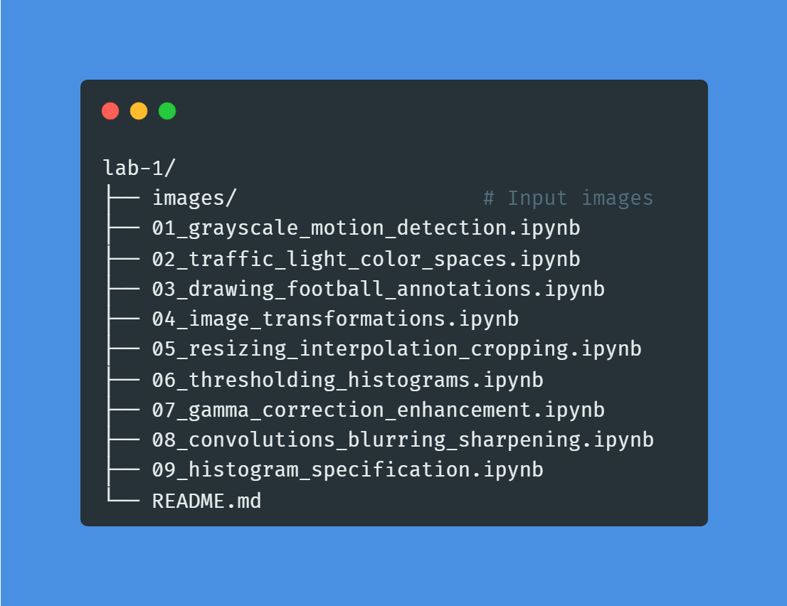

# Computer Vision & Image Processing Projects

A comprehensive collection of OpenCV and image processing projects covering fundamental techniques in computer vision, from basic operations to advanced filtering and enhancement.
.

---

## 📁 Structure

---

## 📋 Projects Overview

### 1. Grayscale & Motion Detection

- Convert images to grayscale
- Detect brightest pixels (light sources)
- **Result:** Grayscale is better for motion detection (faster, less noise)

### 2. Traffic Light Detection (HSV)

- Use HSV color space for color detection
- Create color masks (red, orange, green)
- **Result:** HSV is superior for color detection vs RGB

### 3. Image Annotations

- Draw rectangles, arrows, and text on images
- Annotate football match with ball location and shot info
- **Result:** Visual annotation for object highlighting

### 4. Image Rotation

- Correct tilted photos using rotation matrices
- Apply affine transformations
- **Result:** Straightened 42° tilted image

### 5. Image Resizing & Cropping

- Resize images to 512×512 for e-commerce
- Center crop for square aspect ratio
- Compare interpolation methods (NEAREST, LINEAR, AREA, CUBIC, LANCZOS)
- **Result:** AREA best for downscaling, LANCZOS for quality

### 6. Histogram Analysis & Thresholding

- Analyze low-contrast satellite images
- Apply histogram equalization (PMF → CDF → LUT)
- Use Otsu's thresholding for cloud segmentation
- **Result:** Enhanced contrast and separated clouds from terrain

### 7. Gamma Correction & Enhancement

- Brighten night photos with gamma correction (γ=0.6)
- Apply histogram equalization in YCrCb space
- **Result:** Brightened dark areas while preserving colors

### 8. Convolutions & Denoising

**Key Question:** Is Gaussian blur the best for noise reduction?  
**Answer:** NO! It depends on noise type.

| Noise Type          | Best Filter          |
| ------------------- | -------------------- |
| **Gaussian**        | NL-Means, Bilateral  |
| **Salt-and-Pepper** | **Median Filter** ✅ |
| **Poisson**         | Anscombe + Gaussian  |
| **Speckle**         | Bilateral            |

**Sharpening Workflow:** Denoise → Then Sharpen

**Result:** Median filter perfect for salt-and-pepper, NL-Means best quality for Gaussian noise

### 9. Histogram Specification

- Transfer lighting/style from reference image
- **Y-only matching:** Transfers brightness, preserves colors
- **All-channel matching:** Full style transfer
- **Result:** Successfully transferred illumination while keeping original colors

---

## 🛠️ Technologies

- **Python 3.x**
- **OpenCV** - Image processing
- **NumPy** - Numerical operations
- **Matplotlib** - Visualization
- **scikit-image** - Histogram matching

---

## 🎯 Key Takeaways

**Color Spaces:**

- Use **Grayscale** for motion detection
- Use **HSV** for color detection
- Use **YCrCb** to process brightness separately

**Filters:**

- **Median Filter** → Salt-and-pepper noise ✅
- **Bilateral Filter** → Edge preservation
- **NL-Means** → Best quality (slow)
- **Gaussian Blur** → Only for Gaussian noise

**Best Practices:**

1. ✅ Denoise before sharpening
2. ✅ Match noise type to filter
3. ✅ Use YCrCb for brightness adjustments
4. ✅ AREA interpolation for downscaling

---

**Last Updated:** January 2026
